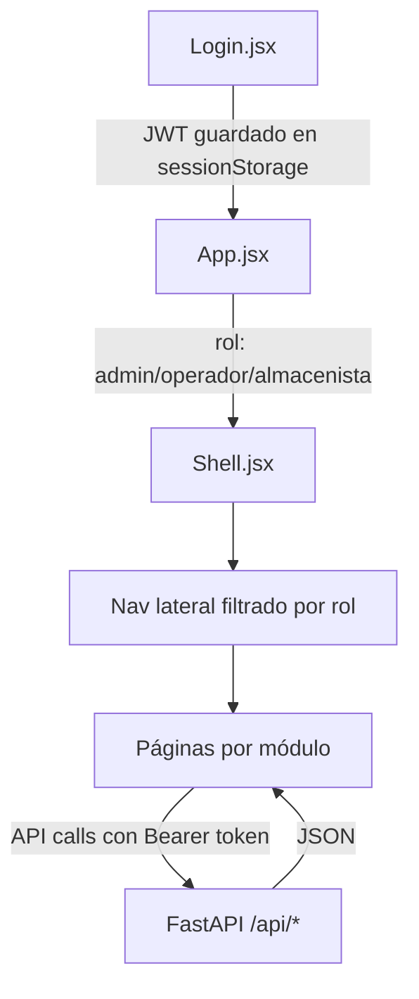

# CLF Sistema — Estado del UI

%%
Documento de referencia para sesiones de trabajo con IA y con el dueño del sistema.
Generado el 2026-05-06 a partir de auditoría completa del código fuente.
%%

Este documento describe el estado actual de la interfaz visual del sistema CLF: qué existe, cómo está construido, qué falta, y qué decisiones hay pendientes.

---

## 1. Contexto rápido

El sistema CLF es una plataforma interna de gestión B2B para una comercializadora en México. Maneja el ciclo completo:

```
Cotización → Compra → Entrega → Factura (CFDI) → Pago
```

Actualmente tiene **dos interfaces activas al mismo tiempo** para el mismo sistema.

> [!info] ¿Por qué dos interfaces?
> El sistema nació con Jinja2 (HTML renderizado en servidor). Después se comenzó a migrar a React. Ambas viven en paralelo durante la transición — pero esa transición nunca se terminó de definir.

---

## 2. Las dos interfaces

### 2.1 Interfaz A — Jinja2 + HTMX (la "vieja")

| Dato | Valor |
|---|---|
| Tecnología | FastAPI + Jinja2 + HTMX |
| Estado | **Producción. Completa.** |
| Ubicación | `web_app/templates/` + `web_app/static/css/styles.css` |
| Quién la usa | Todos los usuarios actuales |

**Módulos disponibles:** Cotizaciones, Compras, Facturas, Stock, Pre-inventario, Catálogos, Estudio de mercado, Estado de cuenta, Análisis, Admin, Herramientas.

> [!success] Ventaja clave
> Toda la lógica de negocio está en el servidor (Python). El HTML llega ya procesado. Menos bugs de sincronización. Más rápido de desarrollar para operaciones internas.

### 2.2 Interfaz B — React + Vite (la "nueva")

| Dato | Valor |
|---|---|
| Tecnología | React 19 + Vite + React Router 7 |
| Estado | **Desarrollo parcial. ~60% de módulos.** |
| Ubicación | `frontend/src/` |
| Deploy | Firebase Hosting → `clf-gestion.web.app` |
| Auth | JWT en `sessionStorage` |

**Módulos con avance:**

| Módulo | Estado React |
|---|---|
| Login | ✅ Completo |
| Dashboard (KPIs) | ✅ Mayormente completo |
| Cotizaciones (lista/detalle/crear) | ✅ Mayormente completo |
| Compras (lista/crear) | 🔄 Parcial |
| Facturas (lista/importar) | 🔄 Parcial — falta UI de vinculación |
| Stock (lista con tabs) | 🔄 Parcial — faltan ABC y movimientos |
| Catálogos (clientes/productos) | 🔄 Parcial — faltan formularios de edición |
| Pre-inventario | ❌ No iniciado |
| Estudio de mercado | ❌ No iniciado |
| Estado de cuenta | ❌ No iniciado |
| Análisis / Reportes | ❌ No iniciado |
| Admin (usuarios, permisos) | ❌ No iniciado |

> [!warning] Problema de mantenimiento
> El CSS del sistema de diseño está **duplicado** entre Jinja y React. Casi el mismo código en `styles.css` y en `frontend/src/index.css`. Cualquier cambio visual hay que hacerlo dos veces.

---

## 3. Sistema de diseño

### 3.1 Filosofía visual

El sistema tiene una identidad clara y coherente:

- **Sin íconos.** Solo texto. Las acciones se leen, no se adivinan.
- **Tipografía como estructura.** Tamaños y pesos dan jerarquía.
- **Enfocado en escritorio.** Existen media queries pero no están completamente integradas.
- **Un solo color de acento.** Verde bosque (`#2d5a45`). Todo lo demás es gris.

### 3.2 Tokens de diseño (variables CSS)

```css
/* Superficie */
--paper: #ffffff          /* fondo principal */
--canvas: #f7f6f3         /* fondo alternativo, páginas */

/* Escala de grises (tinta) */
--ink-900: #111111        /* texto principal */
--ink-600: #6b6b6b        /* texto secundario */
--ink-200: #e5e5e5        /* bordes */
--ink-50:  #fafafa        /* fondos muy suaves */

/* Acento */
--accent:      #2d5a45    /* verde — botones, estados activos */
--accent-soft: #ecf0ed    /* verde suave — highlights */
--accent-ink:  #1a3a2c    /* verde oscuro — texto sobre acento */

/* Semánticos */
--warn:   amarillo        /* advertencias */
--danger: rojo            /* errores, cancelaciones */
--info:   azul            /* información neutral */
```

### 3.3 Tipografía

| Rol | Fuente | Uso |
|---|---|---|
| Principal (sans) | Inter Tight | Todo el texto de UI |
| Numérica (serif) | Source Serif 4 | Cantidades, precios, KPIs |
| Código (mono) | JetBrains Mono | Folios, RFC, códigos SAT |

---

## 4. Inventario de componentes

### 4.1 Componentes base (existen en ambas interfaces)

| Componente | Jinja | React | Descripción |
|---|---|---|---|
| App Shell | `base.html` | `Shell.jsx` | Topbar + nav lateral por rol + menú de usuario |
| Page Header | en templates | implícito en páginas | Título + breadcrumbs + acciones |
| Botones | `styles.css` | `index.css` | Primary, ghost, small |
| Inputs / Selects | `styles.css` | `index.css` | Con focus states |
| Cards / Panels | `styles.css` | `index.css` | Contenedores de información |
| Tabla de datos | `styles.css` | `index.css` | Listados, ordenamiento en Jinja |
| Filter Chips | ✅ | ✅ | Filtros activos/inactivos |
| Status Pill | ✅ | `Pill.jsx` | Estado de cotización con color |
| KPI Cards | `dashboard.html` | `Dashboard.jsx` | Métricas clave en grid |
| Stepper | ✅ | `Stepper.jsx` | Progreso: cotización → OC → stock → entrega → factura → pago |
| Next Action Ribbon | ✅ | `NextRibbon.jsx` | Recomendación contextual de siguiente paso |

### 4.2 Componentes parciales o planificados (solo React)

| Componente | Estado | Descripción |
|---|---|---|
| DataTable | 🔄 En extracción | Tabla con ordenamiento, filtros, paginación |
| SidePreview | 🔄 Planeado | Panel de detalle junto al listado |
| Paginación | 🔄 Planeado | Control de páginas |
| EmptyState | 🔄 Planeado | Vista cuando no hay datos |
| LoadingState | 🔄 Planeado | Skeleton o spinner estándar |
| Modal | 🔄 Planeado | Diálogo de confirmación / formulario |
| Tabs | 🔄 Planeado | Navegación interna (ya usado en Stock) |
| Command palette | 🔄 Planeado | Ctrl+K para navegación rápida |
| Nav móvil | 🔄 Planeado | Barra inferior para móvil |

---

## 5. Flujo de autenticación y navegación



> [!note] Roles disponibles
> - **Administrador** — acceso total
> - **Operador** — cotizaciones, compras, facturas
> - **Almacenista** — stock, pre-inventario, recepciones
> - **Solo lectura** — solo consulta

---

## 6. Arquitectura del frontend React

```
frontend/src/
├── App.jsx               ← Rutas y wrapper de autenticación
├── components/
│   ├── Shell.jsx         ← Topbar + nav por rol
│   ├── Pill.jsx          ← Badge de estado
│   ├── Stepper.jsx       ← Progreso de cotización
│   └── NextRibbon.jsx    ← Acción recomendada
├── pages/
│   ├── Dashboard.jsx
│   ├── Login.jsx
│   ├── cotizaciones/     ← Lista, Detalle, Nueva
│   ├── compras/          ← Lista, Nueva
│   ├── catalogos/        ← Clientes, Productos
│   ├── facturas/         ← Lista, Importar
│   └── stock/            ← Lista con tabs
├── hooks/
│   └── useAuth.js        ← Estado de sesión JWT
├── lib/                  ← Utilidades
├── index.css             ← Sistema de diseño completo
└── App.css               ← Residual de Vite (se puede borrar)
```

> [!bug] Carpetas anómalas detectadas
> Existen carpetas con nombres como `srccomponents`, `srchooks`, `srcpages*` en el directorio frontend. Podrían ser residuos de una operación mal ejecutada. Requieren revisión antes de continuar.

---

## 7. Problemas identificados

### 7.1 Deuda de diseño

> [!warning] CSS duplicado
> `web_app/static/css/styles.css` y `frontend/src/index.css` tienen tokens y componentes casi idénticos. Cualquier cambio visual requiere editar dos archivos. Riesgo de divergencia.

> [!warning] Estilos inline en React
> Varias páginas React usan `style={{...}}` directamente. Esto saltea el sistema de diseño y hace inconsistente el resultado visual.

> [!bug] App.css residual
> `frontend/src/App.css` parece ser el archivo de ejemplo de Vite starter. No aporta nada al sistema. Candidato a eliminar.

### 7.2 Cobertura incompleta

> [!failure] 40% de módulos sin interfaz React
> Pre-inventario, Estudio de mercado, Estado de cuenta, Análisis y Admin no tienen páginas React. Los usuarios que migren a la nueva interfaz no podrán usar estas funciones.

### 7.3 Decisión pendiente — la más importante

> [!question] ¿React reemplaza a Jinja o conviven?
> Esta decisión no está tomada en el código. Tiene consecuencias directas sobre:
> - ¿Vale la pena completar el 40% faltante en React?
> - ¿Se consolida el CSS en un solo lugar?
> - ¿Se elimina Jinja cuando React esté completo?
> - ¿O Jinja se mantiene como interfaz principal y React es solo un experimento?

---

## 8. Mapa de decisiones abiertas

| # | Pregunta | Impacto | Urgencia |
|---|---|---|---|
| D1 | ¿React es el destino final o Jinja se mantiene? | Alto — define toda la estrategia de UI | Alta |
| D2 | ¿Se consolida el CSS en un solo archivo fuente? | Medio — mantenimiento | Media |
| D3 | ¿Se limpian las carpetas anómalas del frontend? | Bajo — riesgo de confusión | Media |
| D4 | ¿Se extrae DataTable como componente reutilizable? | Medio — consistencia visual | Media |
| D5 | ¿Se implementan módulos faltantes en React? | Alto — si D1 = React es destino | Depende de D1 |
| D6 | ¿Se agrega navegación móvil? | Medio — si hay usuarios en móvil | Baja |
| D7 | ¿Se estandarizan los formularios (crear/editar) en React? | Alto — faltan en catálogos y compras | Media |

---

## 9. Preguntas para definir el objetivo correcto

Estas preguntas orientan la siguiente sesión de trabajo:

> [!todo] Para responder juntos
> 1. **¿Quién usa el sistema hoy?** ¿Cuántos usuarios, en qué dispositivos, con qué rol?
> 2. **¿Qué interfaz usan actualmente?** ¿La Jinja (vieja) o ya están en clf-gestion.web.app (React)?
> 3. **¿Hay algo del diseño actual que no funcione bien?** ¿Algo confuso, lento, difícil de usar?
> 4. **¿Cuál es el módulo más crítico que necesita mejora ahora mismo?** ¿Cotizaciones, stock, facturas?
> 5. **¿La migración a React es una prioridad activa o está pausada?**
> 6. **¿Se usa el sistema en móvil?** ¿O es exclusivamente de escritorio?
> 7. **¿Hay un nuevo módulo o flujo que se quiera agregar al sistema?**

---

## 10. Referencias internas

- [[CLF_SISTEMA_REQUISITOS]] — Especificación técnica completa (esquema DB, reglas de negocio, auth)
- [[Project_Context_Componentes_Visuales]] — Inventario previo de componentes visuales
- `frontend/src/index.css` — Fuente de verdad del sistema de diseño (React)
- `web_app/static/css/styles.css` — Sistema de diseño (Jinja)
- `web_app/templates/base.html` — Shell base del servidor

---

*Última actualización: 2026-05-06 — generado por auditoría de código fuente completa.*
