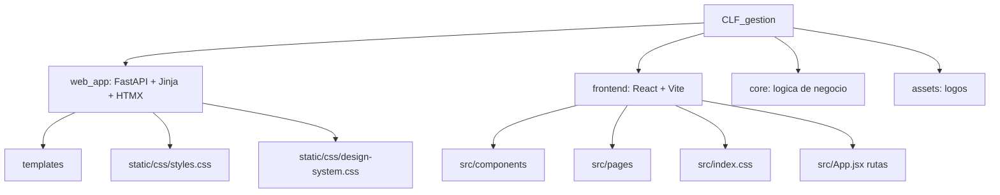

# Estado actual de componentes visuales CLF

> [!abstract] Proposito
> Este documento resume el estado actual de la capa visual de `CLF_gestion` para decidir como maquetar los componentes. Esta basado en la estructura del proyecto, `[[CLF_SISTEMA_REQUISITOS]]`, el SPA React/Vite y las plantillas FastAPI/Jinja existentes.

## Lectura rapida

> [!important] Hallazgo principal
> El proyecto tiene dos superficies visuales activas: una app web legacy/actual en `web_app/templates` con FastAPI + Jinja + HTMX, y una app React/Vite en `frontend/src` que parece estar replicando y modernizando los mismos flujos. Antes de maquetar, conviene decidir si el sistema visual objetivo vivira en React, en Jinja/HTMX, o en ambos con un design system compartido.

| Area | Estado actual | Implicacion para maquetacion |
|---|---|---|
| Arquitectura visual | Doble frente: React/Vite y Jinja/HTMX | Riesgo de duplicar componentes y estilos |
| Estilo base | Sobrio, B2B, tipografia primero, verde forest como acento | Buena base para sistema operativo/administrativo |
| Componentes reutilizables React | Pocos: `Shell`, `Pill`, `Stepper`, `NextRibbon` | Falta extraer tabla, filtros, panel lateral, KPI, formularios |
| CSS | Tokens y clases globales en `frontend/src/index.css` y `web_app/static/css/styles.css` | Hay duplicacion casi directa entre ambas capas |
| Pantallas React | Dashboard, login, cotizaciones, compras, stock, facturas, catalogos | Ya existe patron visual reconocible |
| Plantillas Jinja | Cobertura funcional mas amplia | Probablemente es la app mas completa a nivel operativo |
| Deuda visible | Carpetas anormalmente nombradas en `frontend`: `srccomponents`, `srcpages...` | Revisar si son residuos antes de ordenar estructura |
| Contexto solicitado | `Project_Context.txt` existe pero esta vacio | El contexto util esta en `CLF_SISTEMA_REQUISITOS.md` |

## Mapa de capas

## Estructura visual encontrada

### React/Vite

Ruta base: `frontend/src`

| Carpeta / archivo | Funcion |
|---|---|
| `App.jsx` | Define rutas protegidas, modulos principales y placeholders |
| `components/Shell.jsx` | Shell de aplicacion: topbar, navegacion por rol, usuario, logout |
| `components/Pill.jsx` | Badge de estado para cotizaciones |
| `components/Stepper.jsx` | Progreso de cotizacion: cotizada, OC, stock, entrega, factura, pago |
| `components/NextRibbon.jsx` | Franja contextual con la siguiente accion recomendada |
| `pages/Dashboard.jsx` | Resumen diario, KPIs, pendientes, embudo comercial, stock bajo |
| `pages/cotizaciones/*` | Lista, detalle y alta de cotizaciones |
| `pages/catalogos/*` | Listas de clientes y productos |
| `pages/compras/*` | Lista y alta de compras |
| `pages/facturas/*` | Lista e importacion de CFDI |
| `pages/stock/*` | Inventario y movimientos |
| `index.css` | Tokens, layout, tablas, cards, pills, chips, KPIs, stepper, login |
| `App.css` | Parece contener estilos residuales de starter/demo Vite |

> [!warning] Deuda estructural
> En `frontend` existen carpetas como `srccomponents`, `srchooks`, `srclib`, `srcpagescatalogos`, `srcpagescotizaciones`, etc. No parecen formar parte del arbol normal `src/...`. Conviene confirmar si son carpetas accidentales, residuos de una copia o salida de una herramienta.

### FastAPI/Jinja/HTMX

Ruta base: `web_app`

| Carpeta / archivo | Funcion |
|---|---|
| `templates/base.html` | Shell principal, topbar, nav por rol, toast, sortable tables, PWA |
| `templates/dashboard.html` | Dashboard server-rendered |
| `templates/catalogos/*` | Clientes, productos, proveedores, forms, parciales HTMX |
| `templates/cotizaciones/*` | Lista, detalle, form, costos, seguimiento, preview, parciales |
| `templates/compras/*` | Lista, detalle, form, presupuesto |
| `templates/facturas/*` | Lista, detalle, import result, selectores, tablas |
| `templates/stock/*` | Inventario, movimientos, ubicaciones, modales/parciales |
| `templates/preinventario/*` | Flujos de preinventario y administracion |
| `static/css/styles.css` | Wireframe v1 sobrio usado por Jinja |
| `static/css/design-system.css` | Design System v2 mas amplio, con tokens y componentes |

> [!note] Cobertura funcional
> `web_app/templates` cubre mas modulos que React. React tiene una maqueta funcional importante, pero varios modulos siguen en placeholder: preinventario, estado de cuenta, analisis, administracion y varios detalles.

## Sistema visual actual

### Intencion visual

El sistema apunta a una interfaz operativa B2B: sobria, compacta, legible y orientada a tablas, estados y acciones pendientes. No usa una estetica de landing page; funciona mas como herramienta de gestion diaria.

### Tokens principales

| Token | Uso |
|---|---|
| `--ink-900` a `--ink-50` | Escala monocromatica para texto, bordes y fondos |
| `--paper` | Fondo blanco de superficies |
| `--canvas` | Fondo general en Jinja/design-system |
| `--accent` | Verde forest principal `#2d5a45` |
| `--accent-soft` | Fondo suave para activos/exitos |
| `--warn`, `--danger`, `--info` | Estados semanticos |
| `--sans` | Inter Tight / system |
| `--serif` | Source Serif 4 para numeros destacados |
| `--mono` | JetBrains Mono para folios, RFC, UUID, codigos |

> [!tip] Direccion de diseno
> La base visual ya tiene una voz clara: densa, administrativa, sin decoracion excesiva, con jerarquia por tipografia, lineas finas y estados discretos. La mejora deberia consistir en sistematizar y extraer componentes, no en cambiar radicalmente el lenguaje visual.

## Componentes visuales actuales

| Componente | Existe en React | Existe en Jinja/CSS | Estado | Observaciones |
|---|---:|---:|---|---|
| App shell / topbar | Si | Si | Parcialmente duplicado | Navegacion por rol implementada en ambos lados |
| Page header | Si, clase global | Si, clase global | Reutilizable por clase | Titulo, subtitulo y acciones |
| Breadcrumbs | Si, clase global | Si | Reutilizable | Necesita convencion de contenido |
| Button | Si, CSS global | Si | Base estable | Variantes: default, primary, ghost, sm |
| Input / select | Si, CSS global | Si | Base estable | Falta error/helper text sistematizado |
| Card / panel | Si, CSS global | Si | Base estable | Se usa mucho como contenedor operativo |
| Table | Si, CSS global | Si | Critico | Componente mas importante del sistema |
| Sortable table | No como React component | Si en `base.html` JS global | Divergente | React no comparte esa funcionalidad |
| Chip filter | Si, CSS global | Si | Base estable | Usado en cotizaciones, clientes, productos, facturas |
| Pill status | Si, componente `Pill` | Si, clase CSS | Buen candidato a canonico | Mapea estados de cotizacion |
| KPI | Si, CSS/clase y componentes locales | Si | Repetido | Conviene extraer `KpiGrid` y `KpiCard` |
| Stepper | Si, componente | Si, CSS | Buen candidato a canonico | Enfocado en proceso de cotizacion |
| Next action ribbon | Si, componente | CSS global | Buen patron | Une estado + siguiente accion |
| Side preview panel | Patron repetido inline | Si como clase `side-pre` | No extraido | Aparece en listas de cotizaciones, clientes, productos, compras, facturas |
| Empty/loading states | Inline por pantalla | Inline | Inconsistente | Necesita componente comun |
| Alert/warning | CSS global | Si | Base | Falta patron de errores formales |
| Login card | Si | Si | Base | Sencillo y consistente |
| Modal | En Jinja stock parcial | No claro en React | Pendiente | Necesario para movimientos, confirmaciones, edicion rapida |
| Command palette | CSS/HTML base parcial | JS no consolidado | Incipiente | `Ctrl+K` aparece en Jinja |
| Mobile nav | En `design-system.css` | No integrado en `styles.css` actual | Pendiente | React topbar no parece mobile-first |

## Pantallas React evaluadas

| Pantalla | Estado visual | Patrones usados | Riesgo / mejora |
|---|---|---|---|
| Dashboard | Bastante avanzado | KPIs, tabla de pendientes, embudo, stock bajo | Extraer KPI grid y secciones para consistencia |
| Cotizaciones lista | Avanzado | Filtros chip, tabla, side preview, pill, stepper | Side preview repetible como componente |
| Cotizacion detalle | Avanzado | Header rico, stepper, next ribbon, tablas, sidebar | Buen modelo para flujo operativo |
| Nueva cotizacion | Avanzado pero muy inline | Formulario por secciones, quote builder, buscador producto | Necesita componentes de formulario y line items |
| Clientes | Avanzado | Tabla + side preview + filtros | Badges de tipo estan inline |
| Productos | Avanzado | Stats, filtros, tabla, side preview | Stock badge inline |
| Compras | Medio/avanzado | Tabla + side preview detalle | Estados visuales de compra menos definidos |
| Stock | Medio/avanzado | Tabs con botones, stats, filtros, tabla | Tabs deberian ser componente formal |
| Facturas | Medio/avanzado | Tabla + side preview CFDI | Badges CFDI inline |
| Login | Basico estable | Card centrada | Correcto para etapa actual |

## Estado de rutas React

| Modulo | Ruta | Estado |
|---|---|---|
| Inicio | `/dashboard` | Implementado |
| Cotizaciones | `/cotizaciones`, `/cotizaciones/nueva`, `/cotizaciones/:id` | Implementado |
| Stock | `/stock` | Implementado |
| Compras | `/compras`, `/compras/nueva` | Parcial |
| Preinventario | `/preinventario/*` | Placeholder |
| Facturas | `/facturas`, `/facturas/importar` | Parcial |
| Estado de cuenta | `/estado-cuenta/*` | Placeholder |
| Analisis | `/analisis/*` | Placeholder |
| Catalogos | `/catalogos/clientes`, `/catalogos/productos` | Parcial |
| Admin | `/admin/*` | Placeholder |

## Problemas a resolver antes de maquetar mas

> [!warning] Decision necesaria
> No conviene crear mas componentes visuales sin decidir primero cual es la superficie objetivo. Si React sera la interfaz final, hay que migrar patrones desde Jinja y consolidar el CSS. Si Jinja/HTMX seguira como interfaz principal, React debe tratarse como prototipo o reemplazo gradual.

- Hay duplicacion fuerte entre `frontend/src/index.css` y `web_app/static/css/styles.css`.
- `web_app/static/css/design-system.css` parece una version mas ambiciosa que no esta claramente conectada a `base.html`, que carga `styles.css`.
- React usa muchos estilos inline, lo que acelera prototipado pero dificulta consistencia.
- Los componentes visuales mas repetidos todavia no estan extraidos: tabla de datos, filtros, side preview, KPI grid, tabs, badges semanticos, estados vacios/cargando.
- Las rutas React no cubren todo lo que ya existe en Jinja.
- La app visual parece desktop-first; mobile existe en `design-system.css`, pero no se ve plenamente integrado en React.
- Algunos textos muestran caracteres acentuados en consola como mojibake; verificar en editor si es solo salida de terminal o si los archivos tienen problemas reales de encoding.

## Propuesta de inventario de componentes objetivo

### Nivel 1: Fundacion

- `AppShell`
- `Topbar`
- `RoleNav`
- `Page`
- `PageHeader`
- `Breadcrumbs`
- `Button`
- `Input`
- `Select`
- `Textarea`
- `FormField`
- `Card`
- `SectionHeader`

### Nivel 2: Datos operativos

- `DataTable`
- `TableToolbar`
- `FilterChips`
- `Pagination`
- `EmptyState`
- `LoadingState`
- `KpiGrid`
- `KpiCard`
- `SidePreview`
- `DetailGrid`
- `Money`
- `Folio`
- `CodeText`

### Nivel 3: Dominio CLF

- `StatusPill`
- `QuoteStepper`
- `NextActionRibbon`
- `StockBadge`
- `CfdiTypeBadge`
- `ClientTypeBadge`
- `AbcBadge`
- `QuoteLineEditor`
- `ProductSearch`
- `LinkedFlowsPanel`
- `Timeline/Seguimiento`

## Prioridad sugerida

| Prioridad | Componente / decision | Motivo |
|---:|---|---|
| 1 | Elegir superficie objetivo: React, Jinja/HTMX o hibrido | Evita duplicar trabajo |
| 2 | Consolidar design tokens en una sola fuente | Reduce drift visual |
| 3 | Extraer `DataTable`, `FilterChips`, `SidePreview` | Son los patrones mas repetidos |
| 4 | Formalizar estados: loading, empty, error, warning | Aumenta coherencia de UX |
| 5 | Crear badges de dominio | Evita colores inline y reglas dispersas |
| 6 | Revisar responsive/mobile | La operacion puede requerir almacen/tablet |
| 7 | Limpiar carpetas anormales y CSS residual | Baja ruido estructural |

## Preguntas para encontrar el objetivo correcto

> [!question] Preguntas clave
> Estas preguntas deberian contestarse antes de iniciar una maqueta completa o una refactorizacion visual amplia.

### Producto y usuarios

1. Quien sera el usuario principal diario: administrador, operador comercial, almacenista, cobranza o direccion?
2. Cual es la pantalla mas critica para ahorrar tiempo: cotizaciones, stock, compras, facturas o dashboard?
3. El sistema se usara principalmente en escritorio, laptop, tablet de almacen o movil?
4. La prioridad es capturar datos rapido, analizar pendientes, auditar informacion o presentar documentos al cliente?
5. Que usuario tiene mayor dolor hoy: quien cotiza, quien compra, quien entrega, quien factura o quien cobra?

### Arquitectura visual

1. React/Vite es la interfaz final deseada o es un prototipo paralelo?
2. Jinja/HTMX seguira en produccion mientras React se completa?
3. Quieres un design system compartido que funcione para ambas capas?
4. Deben coexistir las dos interfaces con la misma apariencia durante una transicion?
5. Se puede eliminar o ignorar `App.css` y carpetas anormales de `frontend` si son residuos?

### Maquetacion

1. Prefieres una interfaz densa tipo ERP o una interfaz mas espaciada tipo SaaS moderno?
2. Las tablas deben priorizar muchas columnas visibles o lectura por panel lateral?
3. Los formularios deben ser de una sola pagina o por pasos/secciones?
4. El side preview debe ser el patron principal para revisar detalles sin navegar?
5. La accion recomendada tipo `NextRibbon` debe ser central en todos los flujos?

### Identidad visual

1. El verde forest actual debe mantenerse como color institucional principal?
2. Se deben incorporar los logos de `assets/logo_clf_header.jpg` y `assets/logo_clf_footer.jpg` en la app o solo en PDF/documentos?
3. La interfaz debe sentirse mas corporativa, mas industrial/almacen, o mas financiera?
4. Se permiten iconos en botones y navegacion, o se mantiene la decision actual de tipografia primero y pocos iconos?
5. Quieres mantener `Source Serif 4` para numeros destacados o usar una sola familia tipografica?

### Flujos de negocio

1. En cotizaciones, cual es el objetivo principal: crear rapido, dar seguimiento o saber la siguiente accion?
2. En stock, importa mas el valor de inventario, los faltantes, ubicaciones o movimientos?
3. En compras, se debe partir desde cotizaciones sin stock o desde facturas/proveedores?
4. En facturas CFDI, el foco es importar, vincular, auditar o cobrar?
5. En dashboard, debe mostrar salud del negocio o tareas accionables del dia?

## Siguiente entregable recomendado

> [!todo] Proximo paso
> Convertir este inventario en una especificacion de componentes: nombre, proposito, props/datos, variantes visuales, estados, ejemplos de uso y pantalla donde aparece.

Checklist sugerido:

- [ ] Confirmar si React es la interfaz objetivo.
- [ ] Confirmar si el design system debe servir tambien a Jinja/HTMX.
- [ ] Elegir 3 pantallas prioritarias para maquetar primero.
- [ ] Definir densidad visual: compacta, media o amplia.
- [ ] Extraer los primeros componentes repetidos: `DataTable`, `SidePreview`, `FilterChips`.
- [ ] Revisar encoding real de archivos con acentos.
- [ ] Limpiar o documentar carpetas anormales de `frontend`.

## Fuentes revisadas

- `CLF_SISTEMA_REQUISITOS.md`
- `Project_Context.txt`
- `frontend/package.json`
- `frontend/src/App.jsx`
- `frontend/src/index.css`
- `frontend/src/App.css`
- `frontend/src/components/Shell.jsx`
- `frontend/src/components/Pill.jsx`
- `frontend/src/components/Stepper.jsx`
- `frontend/src/components/NextRibbon.jsx`
- `frontend/src/pages/Dashboard.jsx`
- `frontend/src/pages/cotizaciones/*`
- `frontend/src/pages/catalogos/*`
- `frontend/src/pages/compras/*`
- `frontend/src/pages/stock/*`
- `frontend/src/pages/facturas/*`
- `web_app/templates/base.html`
- `web_app/static/css/styles.css`
- `web_app/static/css/design-system.css`

